# Praktikum 1

## Langkah 1: Buat Project Baru

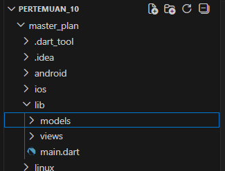

## Langkah 2: Membuat model task.dart

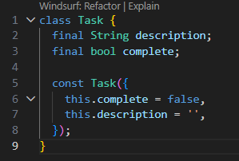

## Langkah 3: Buat file plan.dart

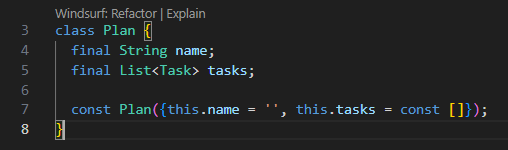

## Langkah 4: Buat file data_layer.dart

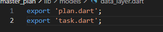

## Langkah 5: Pindah ke file main.dart

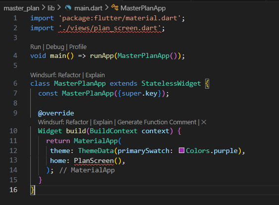

## Langkah 6: buat plan_screen.dart

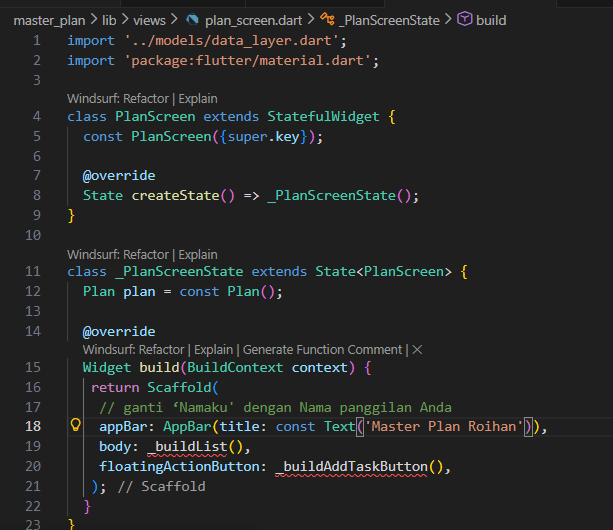

## Langkah 7: buat method _buildAddTaskButton()

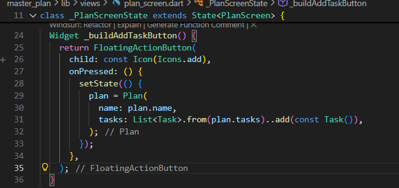

## Langkah 8: buat widget _buildList()

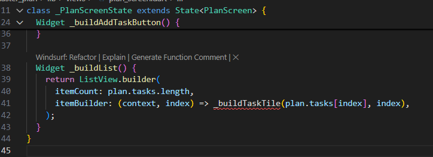

## Langkah 9: buat widget _buildTaskTile

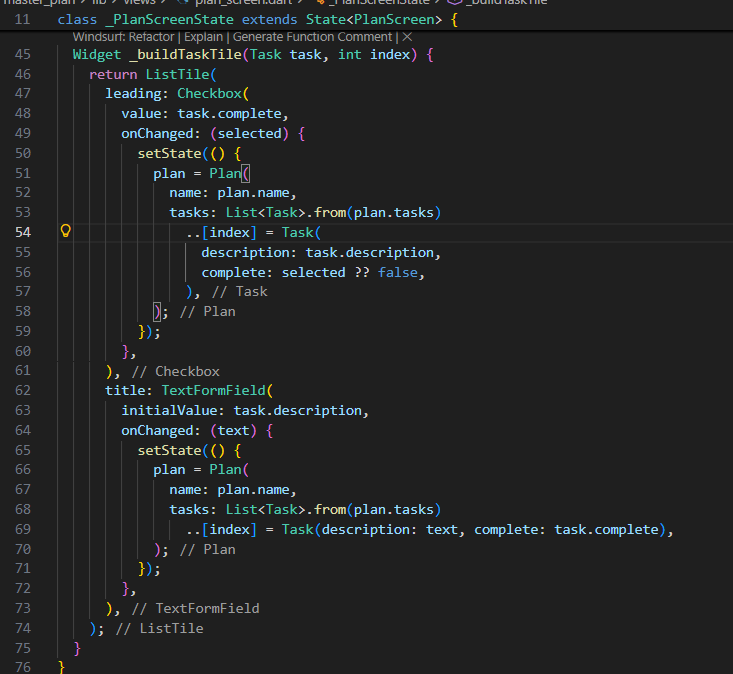

## Output

## Langkah 10: Tambah Scroll Controller

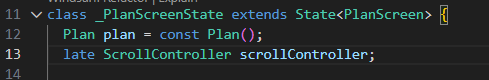

## Langkah 11: Tambah Scroll Listener

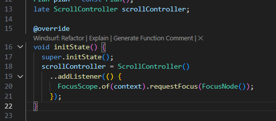

## Langkah 12: Tambah controller dan keyboard behavior

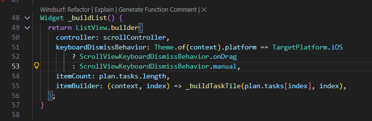

## Langkah 13: Terakhir, tambah method dispose()

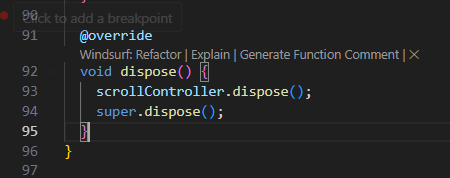

## Langkah 14: Hasil

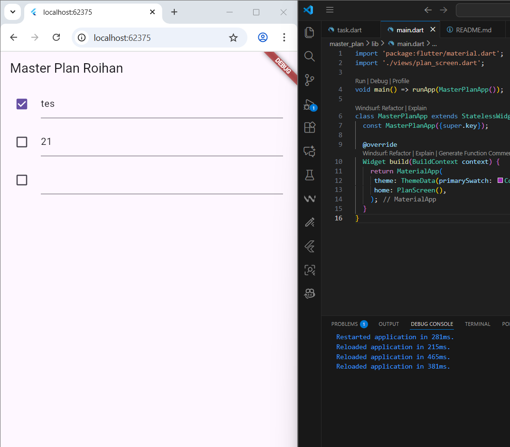

Ketika dilakukan hot reload, list tetap ada, namun ketika di restart, list hilang dan aplikasi menjadi sama saat pertama kali di run.

# Tugas Praktikum 1

1. Selesaikan langkah-langkah praktikum tersebut, lalu dokumentasikan berupa GIF hasil akhir praktikum beserta penjelasannya di file README.md! Jika Anda menemukan ada yang error atau tidak berjalan dengan baik, silakan diperbaiki.
Sudah dilakukan.

2. Jelaskan maksud dari langkah 4 pada praktikum tersebut! Mengapa dilakukan demikian?
Jawab:
Langkah 4 bertujuan membuat file data_layer.dart sebagai barrel file yang mengelompokkan dan mengekspor beberapa model (plan.dart dan task.dart) dalam satu pintu impor; ini dilakukan agar struktur proyek lebih rapi, mengurangi banyaknya baris import di file lain, serta memudahkan maintenance dan skalabilitas ketika jumlah model bertambah.

3. Mengapa perlu variabel plan di langkah 6 pada praktikum tersebut? Mengapa dibuat konstanta ?
Jawab:
Variabel plan pada Langkah 6 diperlukan sebagai state data utama yang merepresentasikan satu rencana (Plan) beserta daftar task yang ditampilkan dan dimodifikasi di UI; Plan() dibuat sebagai const karena nilai awalnya bersifat immutable, ringan secara memori, dan sesuai prinsip Flutter bahwa state baru akan dibuat ulang setiap kali terjadi perubahan melalui setState, bukan dimodifikasi langsung.

4. Lakukan capture hasil dari Langkah 9 berupa GIF, kemudian jelaskan apa yang telah Anda buat!
Jawab:

Pada Langkah 9, widget _buildTaskTile yang dibuat menghasilkan tampilan daftar task berbentuk ListTile dinamis, di mana setiap item memiliki Checkbox untuk status selesai dan TextFormField untuk mengubah deskripsi task; ketika checkbox dicentang atau teks diubah, state plan diperbarui dengan membuat objek Plan dan Task baru (immutable update), sehingga UI otomatis rebuild—hasil akhirnya adalah daftar task interaktif yang responsif terhadap perubahan input pengguna (GIF tidak dapat saya lampirkan di sini, namun perilakunya adalah checklist dan teks yang langsung sinkron dengan data).

5. Apa kegunaan method pada Langkah 11 dan 13 dalam lifecyle state ?
Jawab:
Method initState() pada Langkah 11 digunakan untuk inisialisasi awal state sebelum widget dirender, khususnya untuk memasang ScrollController dan listener agar fokus keyboard dilepas saat pengguna melakukan scroll, sedangkan method dispose() pada Langkah 13 berfungsi membersihkan resource (seperti scrollController) ketika widget dihapus dari tree agar tidak terjadi memory leak, sesuai siklus hidup State pada Flutter.

6. Kumpulkan laporan praktikum Anda berupa link commit atau repository GitHub ke dosen yang telah disepakati !

# Praktikum 2

## Langkah 1: Buat file plan_provider.dart

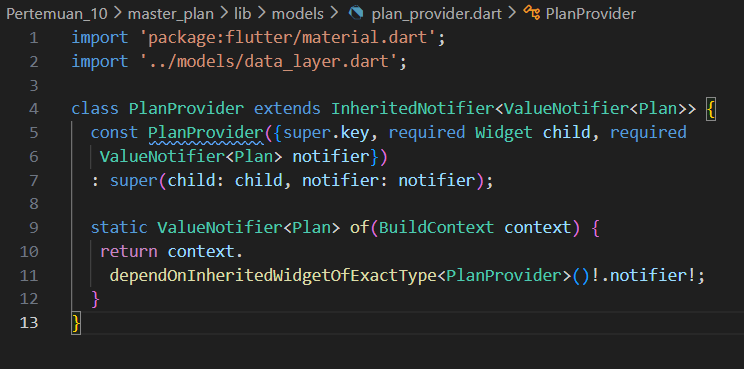

## Langkah 2: Edit main.dart

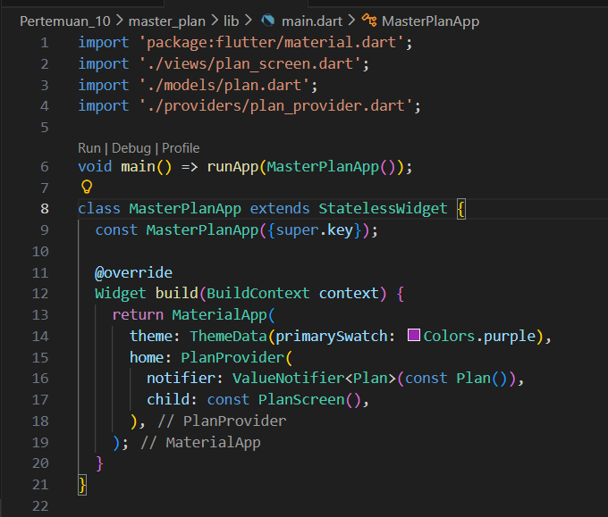

## Langkah 3: Tambah method pada model plan.dart

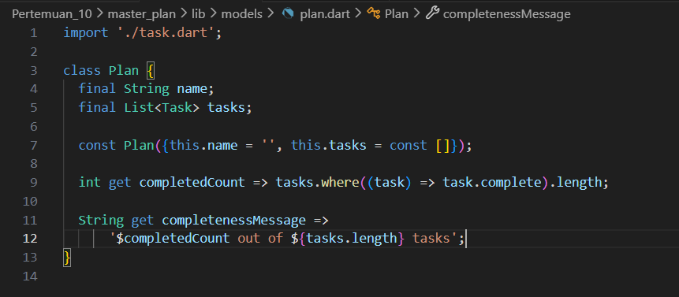

## Langkah 4: Pindah ke PlanScreen

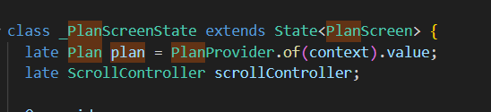

Variabel plan dihapus dan diganti plan provider

## Langkah 5: Edit method _buildAddTaskButton

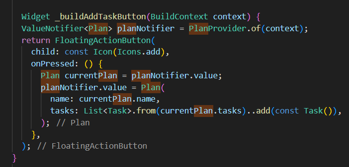

## Langkah 6: Edit method _buildTaskTile

## Langkah 7: Edit _buildList

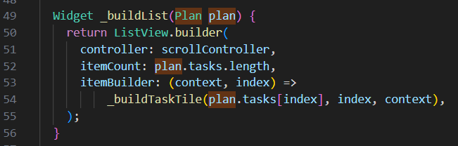

##  Langkah 8: Tetap di class PlanScreen

##  Langkah 9: Tambah widget SafeArea

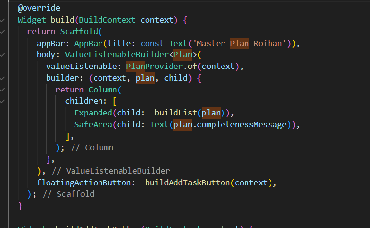

## Output

# Tugas Praktikum 2

1. Selesaikan langkah-langkah praktikum tersebut, lalu dokumentasikan berupa GIF hasil akhir praktikum beserta penjelasannya di file README.md! Jika Anda menemukan ada yang error atau tidak berjalan dengan baik, silakan diperbaiki sesuai dengan tujuan aplikasi tersebut dibuat.

2. Jelaskan mana yang dimaksud InheritedWidget pada langkah 1 tersebut! Mengapa yang digunakan InheritedNotifier?
Jawab:
Yang dimaksud InheritedWidget pada Langkah 1 adalah PlanProvider, karena ia mewarisi mekanisme pewarisan data ke widget-tree melalui InheritedNotifier; digunakan InheritedNotifier (bukan InheritedWidget biasa) karena state Plan dibungkus dalam ValueNotifier, sehingga setiap perubahan nilai notifier otomatis memicu rebuild widget yang bergantung padanya tanpa perlu memanggil setState, membuat manajemen state lebih efisien dan reaktif.

3. Jelaskan maksud dari method di langkah 3 pada praktikum tersebut! Mengapa dilakukan demikian?
Jawab:
Method completedCount berfungsi menghitung jumlah task yang sudah selesai dengan memfilter task yang bernilai complete == true, sedangkan completenessMessage menghasilkan teks ringkasan progres (misalnya “2 out of 5 tasks”); ini dilakukan untuk memisahkan logika bisnis dari UI, sehingga perhitungan progres tidak ditulis berulang di widget dan kode menjadi lebih bersih serta mudah dirawat.

4. Lakukan capture hasil dari Langkah 9 berupa GIF, kemudian jelaskan apa yang telah Anda buat!
Jawab:

Pada Langkah 9, widget SafeArea menampilkan completenessMessage di bagian bawah layar dengan aman dari area terpotong (notch, gesture bar), sehingga pengguna selalu melihat ringkasan progres task; hasil akhirnya adalah tampilan daftar task dengan indikator jumlah task selesai yang otomatis diperbarui setiap kali checkbox diubah atau task ditambahkan (GIF menunjukkan teks progres di bawah layar yang berubah secara real-time mengikuti interaksi pengguna).

# Praktikum 3

## Langkah 1: Edit PlanProvider

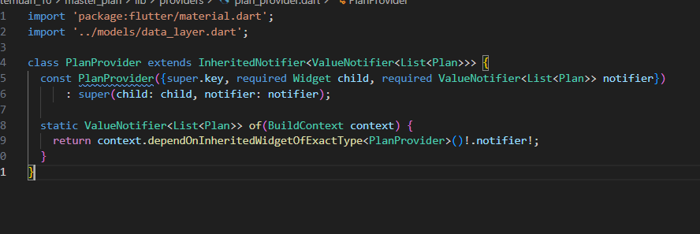

## Langkah 2: Edit main.dart

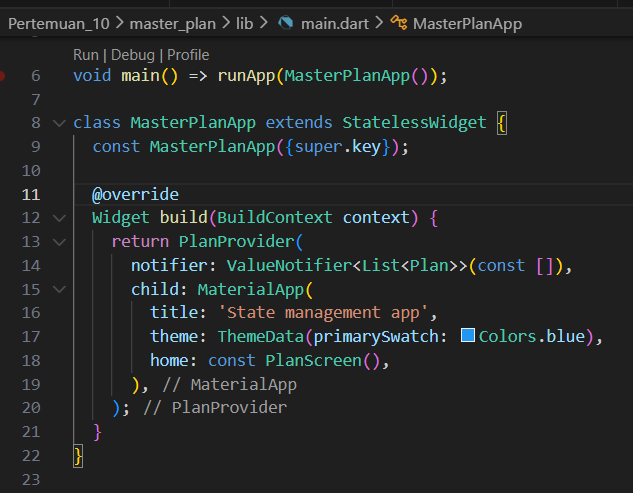

## Langkah 3: Edit plan_screen.dart

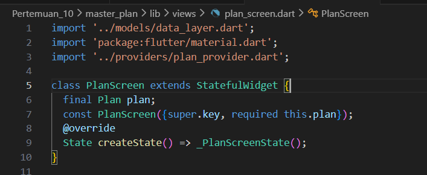

## Langkah 4: Error

## Langkah 5: Tambah getter Plan

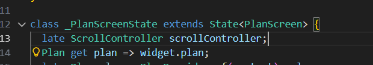

## Langkah 6: Method initState()

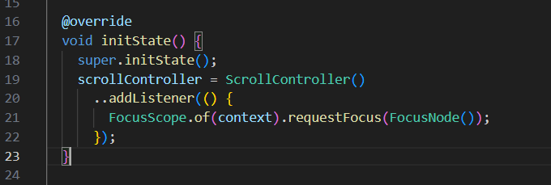

## Langkah 7: Widget build

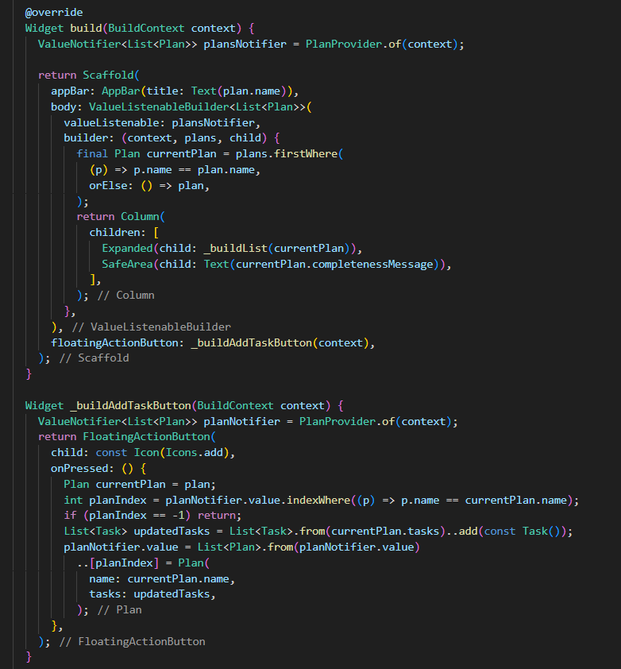

## Langkah 8: Edit _buildTaskTile

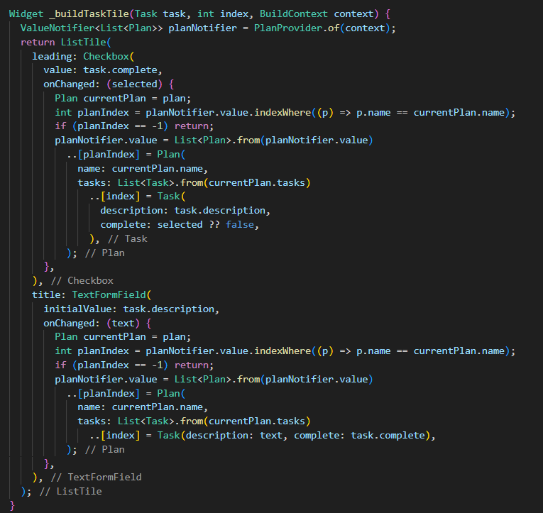

## Langkah 9: Buat screen baru

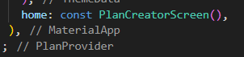

## Langkah 10: Pindah ke class _PlanCreatorScreenState

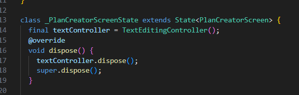

## Langkah 11: Pindah ke method build

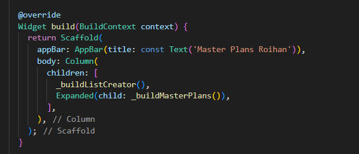

## Langkah 12: Buat widget _buildListCreator

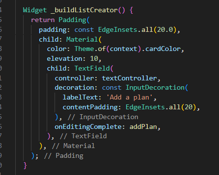

## Langkah 13: Buat void addPlan()

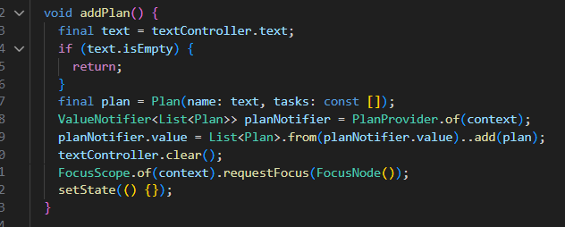

## Langkah 14: Buat widget _buildMasterPlans()

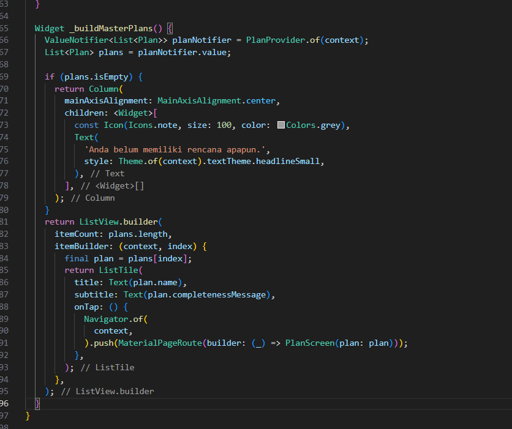

# Tugas Praktikum 3

1. Selesaikan langkah-langkah praktikum tersebut, lalu dokumentasikan berupa GIF hasil akhir praktikum beserta penjelasannya di file README.md! Jika Anda menemukan ada yang error atau tidak berjalan dengan baik, silakan diperbaiki sesuai dengan tujuan aplikasi tersebut dibuat.

2. Berdasarkan Praktikum 3 yang telah Anda lakukan, jelaskan maksud dari gambar diagram berikut ini!
Jawab:
Diagram tersebut menggambarkan alur navigasi dan pewarisan state di Praktikum 3: MaterialApp membungkus PlanProvider yang membawa ValueNotifier<List<Plan>>, lalu menampilkan PlanCreatorScreen dengan kolom berisi TextField untuk menambah rencana dan ListView daftar rencana; saat sebuah rencana dipilih, terjadi Navigator.push ke PlanScreen yang dibangun dengan Scaffold berisi kolom: Expanded menampilkan daftar task (ListView) dan SafeArea menampilkan ringkasan progres (Text). Semua data plan dan task diambil dari PlanProvider, sehingga setiap perubahan pada task memicu rebuild otomatis melalui notifier dan menjaga sinkronisasi UI di kedua layar.

3. Lakukan capture hasil dari Langkah 14 berupa GIF, kemudian jelaskan apa yang telah Anda buat!
Jawab:

GIF Langkah 14 memperlihatkan aplikasi “Master Plans” lengkap: pengguna menambah rencana melalui field “Add a plan”, daftar rencana muncul, lalu saat rencana diklik terbuka detail PlanScreen berisi daftar task dengan checkbox dan teks yang dapat diubah. Menambah task, mengubah deskripsi, atau mencentang status langsung memperbarui ringkasan progres di bagian bawah berkat pembaruan data immutabel lewat ValueNotifier<List<Plan>> pada PlanProvider.