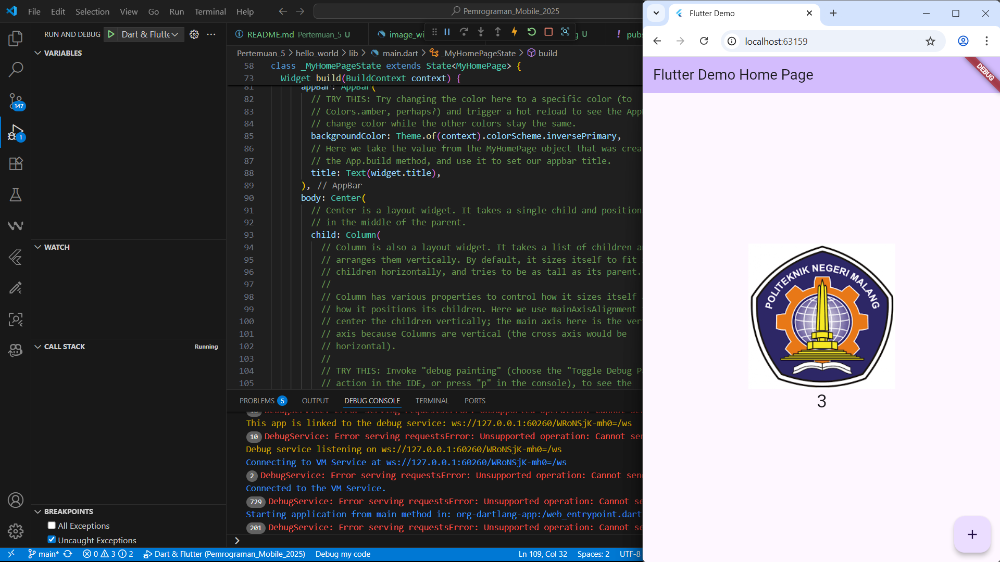
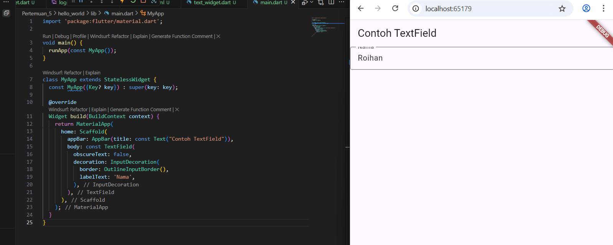
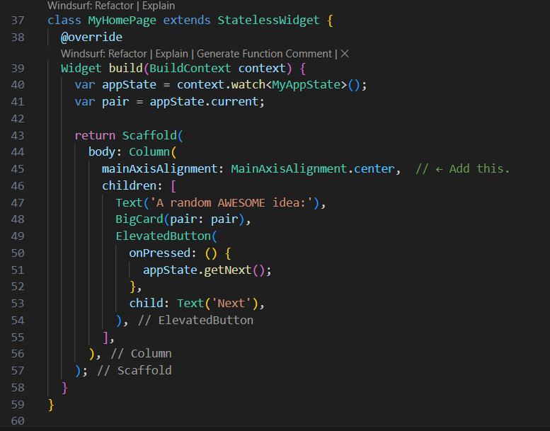
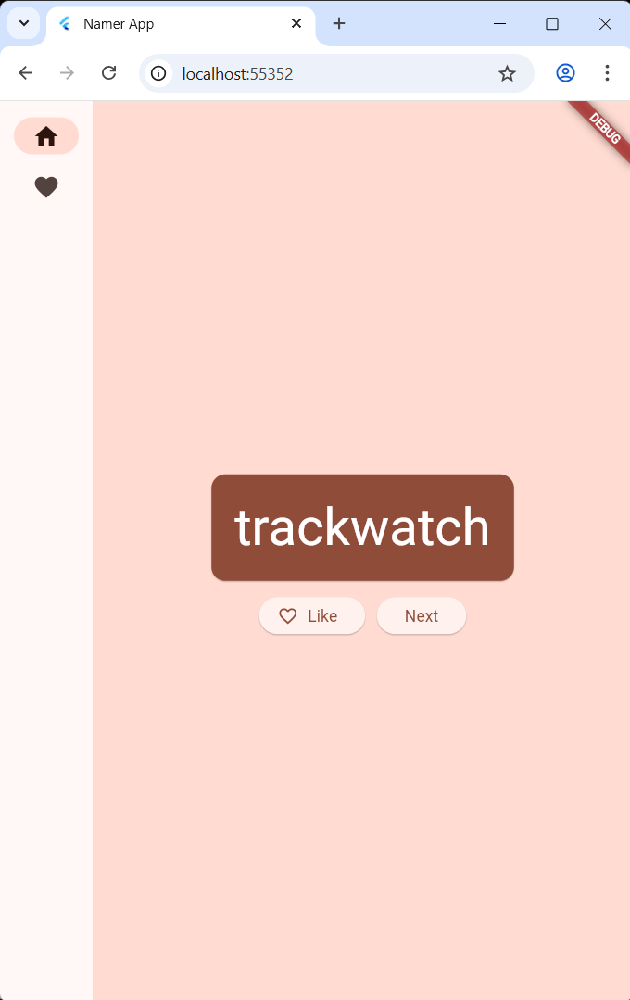
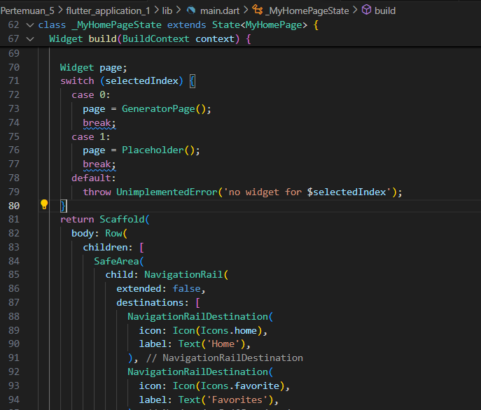

# Praktikum 1

Langkah 1-4

# Praktikum 2

Langkah 1 : Mengaktifkan proses debug USB

Langkah 2 : Menginstall google usb driver dalam android studio pada sdk manager

Langkah 3 : Menjalankan aplikasi di android menggunakan kabel

# Praktikum 3

push ke github

Langkah 11: Menjalankan debug di chrome

Langkah 12: Menambahkan nama dan ss pada readme hello_world

# Praktikum 4

Langkah 1: Text Widget

--import ke main dan ditampilkan

Langkah 2: Image Widget

--Lakukan penyesuaian asset pada file pubspec.yaml dan tambahkan file logo Anda di folder assets project hello_world.

--hasil run

# Praktikum 5

Langkah 1: Cupertino Button dan Loading Bar

Langkah 2: Floating Action Button (FAB)

Langkah 3: Scaffold Widget

Langkah 4: Dialog Widget

Langkah 5: Input dan Selection Widget

Langkah 6: Date and Time Pickers

# Tugas

Selesaikan Codelabs: Your first Flutter app, lalu buatlah laporan praktikumnya dan push ke repository GitHub Anda!

Langkah 3: Create Project

Langkah 4: Add button

Langkah 5: Make the app pretier

Langkah 6: Add functionally

Langkah 7: Add navigation rail

Langkah 8: Add a new page

