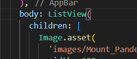
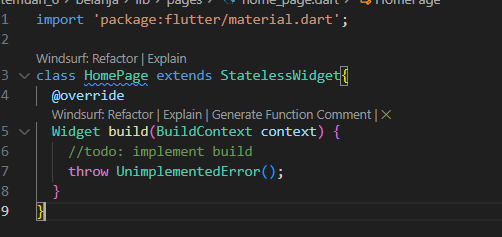
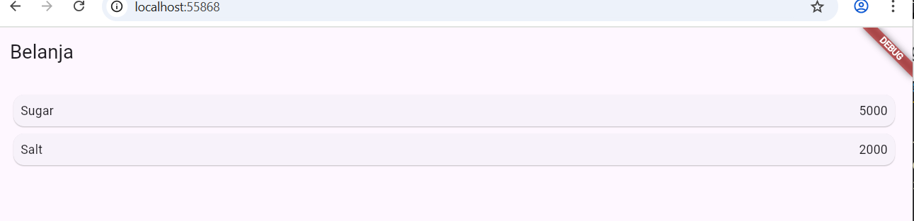

# Praktikum 1

## Langkah 1: Buat Project Baru

## Langkah 2: Buka file lib/main.dart

## Langkah 3: Identifikasi layout diagram

## Langkah 4: Implementasi title row

# Praktikum 2: Implementasi button row

## Langkah 1: Buat method Column _buildButtonColumn

## Langkah 2: Buat widget buttonSection

## Langkah 3: Tambah button section ke body 

# Praktikum 3: Implementasi text section

## Langkah 1: Buat widget textSection

## Langkah 2: Tambahkan variabel text section ke body

# Praktikum 4: Implementasi image section

## Langkah 1: Siapkan aset gambar

## Langkah 2: Tambahkan gambar ke body

## Langkah 3: Terakhir, ubah menjadi ListView

   

# Tugas Praktikum 1

# Praktikum 5: Membangun Navigasi di Flutter

## Langkah 1: Siapkan project baru

## Langkah 2: Mendefinisikan Route

## Langkah 3: Lengkapi Kode di main.dart

## Langkah 4: Membuat data model

## Langkah 5: Lengkapi kode di class HomePage

## Langkah 6: Membuat ListView dan itemBuilder

## Langkah 7: Menambahkan aksi pada ListView

